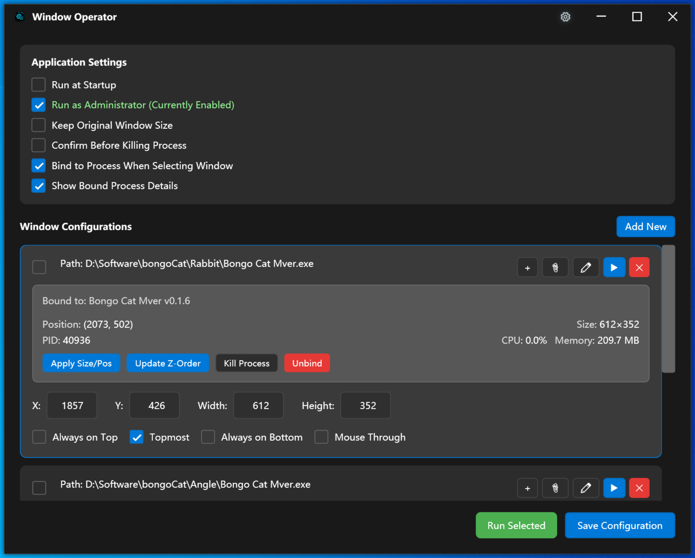
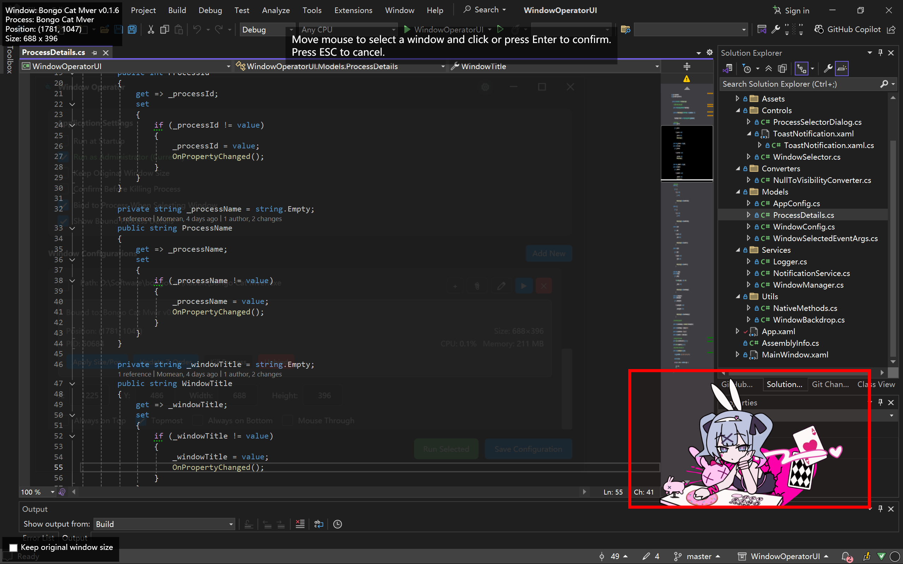

# WindowOperatorUI

<div align="center">
  
  <p>
    <strong>A powerful, flexible window management tool for Windows</strong>
  </p>
  <p>
    <a href="#features">Features</a> •
    <a href="#installation">Installation</a> •
    <a href="#usage">Usage</a> •
    <a href="#screenshots">Screenshots</a> •
    <a href="#roadmap">Roadmap</a> •
    <a href="#contributing">Contributing</a> •
    <a href="#license">License</a>
  </p>
  
  
  
  
  [](https://github.com/username/WindowOperatorUI)
</div>

## Introduction

WindowOperatorUI is an advanced window management utility designed for Windows systems. It allows you to precisely control the position, size, and behavior of application windows, creating a tailored desktop experience with support for custom layouts and automated window arrangement.

## Features

- **Precise Window Positioning**: Place windows at exact coordinates on your screen
- **Custom Window Sizing**: Resize windows to preferred dimensions or keep their original size
- **Application Management**: Launch and manage applications with custom parameters
- **Advanced Window Properties**:
  - Set windows to always stay on top
  - Make windows click-through (mouse events pass through to windows beneath)
  - Keep windows at the bottom of the Z-order
- **Execution Controls**: Run configurations individually or in batches
- **Modern Fluent UI**: Clean, modern interface with toast notifications instead of modal dialogs
- **Persistent Configurations**: Save and load window layouts and settings
- **Administrator Mode**: Optional elevated privileges for controlling admin applications

## Installation

### System Requirements

- Windows 10/11
- .NET 8.0 Runtime

### Download Options

- **[Download Latest Release](https://github.com/username/WindowOperatorUI/releases/latest)**
- Or build from source:

```bash
git clone https://github.com/username/WindowOperatorUI.git
cd WindowOperatorUI
dotnet build --configuration Release
```

## Usage

### Window Configuration

1. **Create a new configuration**:
   - Click the "Add New" button to create a new window setup
   - Specify the application path, position (X, Y coordinates), and optional size (Width, Height)

2. **Select an existing window**:
   - Click the crosshair icon to visually select a window
   - Check "Keep original size" to maintain the window's dimensions

3. **Path Management**:
   - Use the edit button (pencil icon) to modify executable paths
   - Browse your file system to select applications

4. **Run Configurations**:
   - Click the play button to run a single configuration
   - Select multiple configurations using checkboxes
   - Use "Run Selected" to launch multiple configurations at once

### Advanced Options

- **Window Behavior**:
  - Set windows to stay on top with the "Always on Top" option
  - Enable click-through with "Enable Mouse Through"
  - Set windows to stay at the bottom with "Always on Bottom"

- **Application Settings**:
  - Launch at Windows startup
  - Run with administrator privileges
  - Keep original window dimensions

## Screenshots

<div align="center">
  
  <p><em>Main application interface</em></p>
  
  
  <p><em>Window selection with crosshair tool</em></p>
</div>

## Roadmap

- Multi-monitor support with per-monitor configuration
- Keyboard shortcut customization
- Window grouping and layout presets
- Scripting/automation support

## Contributing

Contributions are welcome! Here's how you can help:

1. Fork the repository
2. Create a feature branch (`git checkout -b feature/amazing-feature`)
3. Commit your changes (`git commit -m 'Add some amazing feature'`)
4. Push to the branch (`git push origin feature/amazing-feature`)
5. Open a Pull Request

Please read our [Contributing Guidelines](CONTRIBUTING.md) for more details.

## License

This project is licensed under the MIT License - see the [LICENSE](LICENSE) file for details.

## Acknowledgements

- Icons from [Segoe MDL2 Assets](https://docs.microsoft.com/en-us/windows/apps/design/style/segoe-ui-symbol-font)
- Built with [WPF](https://github.com/dotnet/wpf) and [.NET 8.0](https://dotnet.microsoft.com/download/dotnet/8.0)

---

<div align="center">
  <sub>Built with ❤️ by [Your Name/Team]</sub>
</div> 